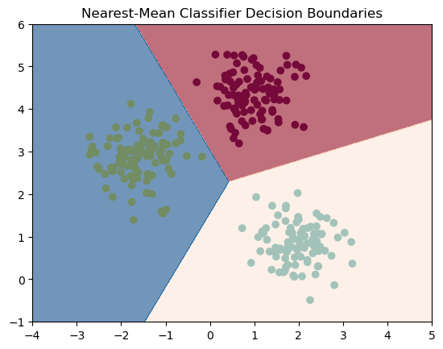
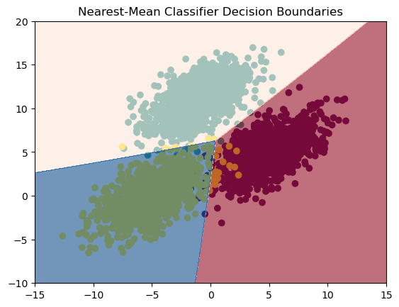
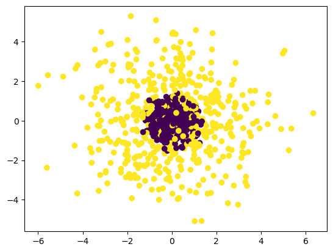
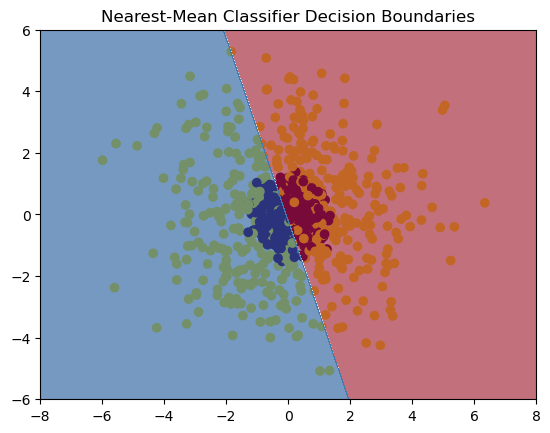
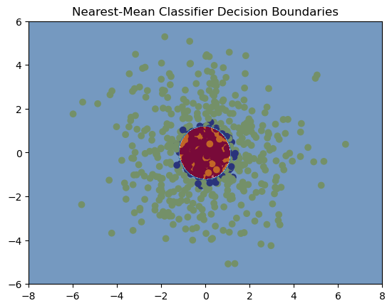
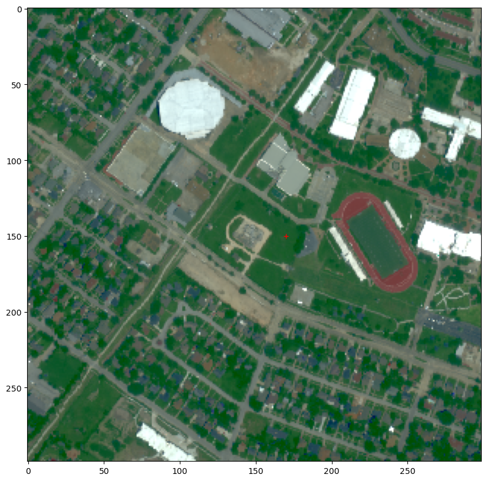
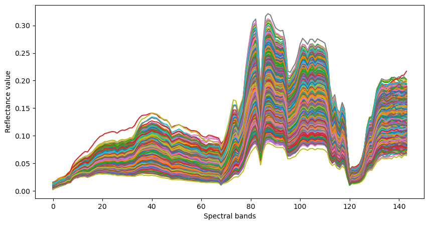
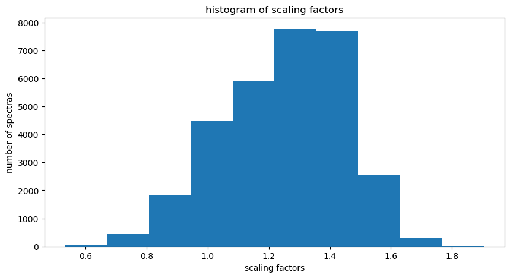
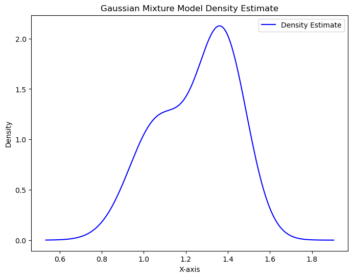
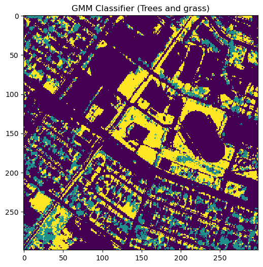

# Bayesian-Classification

This project aims at exploring Bayesian classification related techniques using scikit-learn. Its composed of a notebook explaining all the methodology used to solve both **supervized and unsupervized classification** problems. The project is divided into two parts : the first part explains how to use **linear and quadratic discriminant analysis** to solve supervized classification problems. The second part shows a solution to an unsupervized problem about hyperspectral images using **Generative Gaussian Models**

## Supervised classification with Linear and Quadratic Discriminant Analysis on toy datasets

### Gaussian distributed dataset with identity covariance
We start this part by applying LDA (Linear discriminant analysis) on a gaussian distributed toy dataset with identity covariance. In this case the LDA algorithm is reduced to the nearest mean classifier and we obtain the following decision boundary:
 

### Gaussian distributed dataset with same covariance but different than identity
We then choose as a dataset a gaussian distributed dataset with same covariance but different than identity. We use this time as a distance metric the **Mahanalobis distance**. We obtain the following decision boundary.

### Gaussian blobs with different covariances but identical means
The LDA doesn't work on this type of dataset as shown in this figure:

So we use the QDA (Quadratic discriminant ananlysis) to solve this classification problem: We calculate the log posteriori densities given by :
\begin{equation*}
\textrm{ln} \ p(\mathcal{C}_{k}|\mathbf{x}) = g_{k}(\mathbf{x}) = -\frac{1}{2} (\mathbf{x}_{n} - \boldsymbol{\mu}_{k})^{\top}\boldsymbol{\Sigma_{k}^{-1}} (\mathbf{x}_{n} - \boldsymbol{\mu}_{k}) - \frac{1}{2} \log \det (\boldsymbol{\Sigma}_{k}) + \textrm{cst} 
\end{equation*}

We obtain this result:

## Unsupervised classification (clustering) with a Gaussian Mixture Model on a real dataset

In this second part, we apply Gaussian Mixture models to a hyperspectral image. The image we use was acquired in 2012 above the campus of The university of Houston, Texas, USA. It has a spatial resolution of 1m, and 144 spectral bands (wavelengths).  
 
We use GMMs to classify two types of vegetation (grass and trees) in a real world hyperspectral image in an unsupervised way.

Below you can see the RGB composition of the image and the corresponding hyperspectral composition for each pixel of the image.

We start by reduce the dimension of the hyperspectral data into 1 dimension which is the scaling factors using a regression technique, then we plot the histogram of the scaling factors:

We then apply GMM with 2 components "(grass and trees)" to estimate the gaussian mixture model density:

Finally we use the resulting posterior probabilities to make a binary classifier separating grass from trees. We obtain the following result:
